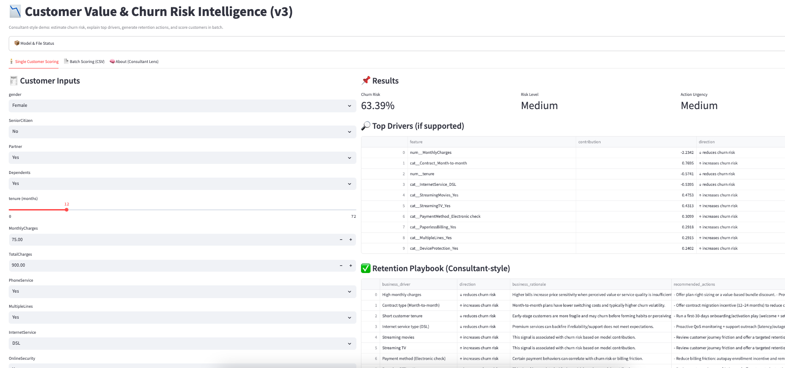

# Customer Value & Churn Risk Intelligence System (Telco Demo)

A consultant-style **end-to-end churn analytics demo**: explore churn drivers, train an interpretable baseline model, package the model as a reusable pipeline, and deploy a **Streamlit** app that scores customers and recommends retention actions.

> Dataset: Telco Customer Churn (CSV) in `data/telco_customer_churn.csv` (public demo dataset).

---

## What this project delivers

### 1) Analytics (Notebooks)
- **Notebook 1 — Segmentation / EDA framing**  
  Define the business problem, KPIs, and hypotheses for churn risk and retention levers.
- **Notebook 2 — Exploratory Data Analysis (EDA)**  
  Data quality checks, churn distribution, and key churn driver analysis (tenure, contract, charges, etc.).
- **Notebook 3 — Modeling + Pipeline + Explainability**  
  Logistic Regression baseline (AUC, confusion matrix), coefficient interpretation, sample-level driver contributions, and export of the trained pipeline to `artifacts/churn_pipeline.joblib`.

### 2) Product (Streamlit App)
**`streamlit_app.py`** provides:
- **Single-customer scoring**: churn probability + risk level + action urgency
- **Top driver explanations** *(best-effort for linear/logistic pipelines)*
- **Retention playbook**: driver → rationale → recommended actions
- **Batch scoring**: upload CSV and download scored results

---

## Project structure

```text
Customer_Value_and_Risk_Intelligence_System/
├── 01_Customer_Segm..._Clustering.ipynb
├── 02_Modeling_Experi..._Validation.ipynb
├── 03_Data_Pipeline_a...ability_Notes.ipynb
├── streamlit_app.py
├── artifacts/
│   └── churn_pipeline.joblib
└── data/
    └── telco_customer_churn.csv
```

---

## Quickstart

### 1) Create environment & install dependencies

```bash
python -m venv .venv
source .venv/bin/activate  # macOS/Linux
# .venv\Scripts\activate  # Windows PowerShell

pip install -r requirements.txt
```

### 2) Run the Streamlit app

From the **project root**:

```bash
streamlit run streamlit_app.py
```

Open the local URL shown in your terminal (usually `http://localhost:8501`).

---

## Model artifact (important)

The app expects a trained pipeline at:

```text
artifacts/churn_pipeline.joblib
```

If you retrain the model in Notebook 3, **re-export** the pipeline to the same path so the app uses the latest version.

---

## Notes on interpretability

- The “Top Drivers” section uses **coefficient-based contributions** (linear explanation).
- It works best when the saved pipeline contains:
  - preprocessing (e.g., ColumnTransformer / OneHotEncoder) **and**
  - a linear estimator with `coef_` (e.g., LogisticRegression)
- For tree-based models (XGBoost/LightGBM), use **SHAP** in a future version.

---

## Suggested talking points (for recruiters)

- End-to-end workflow: **EDA → baseline model → pipeline packaging → deployed app**
- Consultant framing: translate churn risk into **actionable retention plays**
- Supports both **single scoring** and **batch scoring** (campaign-ready)

---

## Roadmap (v4 ideas)

- SHAP explanations for non-linear models (e.g., XGBoost/LightGBM)
- Threshold tuning by business cost (retention ROI / discount cost)
- Monitoring: drift checks + monthly re-scoring workflow
- Campaign simulator: expected saves vs offer cost

---

## Disclaimer

This is a **demo project** for portfolio purposes. It is not production-grade scoring and does not use real customer data.

---
## Demo Screenshot

